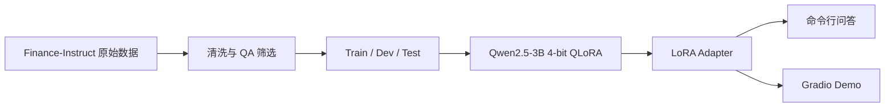

# Finance LLM Assistant

一个金融领域大模型适配实验：使用 **Qwen2.5-3B、4-bit QLoRA 与 Finance-Instruct 数据集**，搭建从数据清洗、指令微调到本地推理的完整工程管线。

这个项目的重点不是提供实时投顾，也不是直接预测市场，而是验证一个问题：能否用有限 GPU 资源，让通用小模型更好地理解金融概念问答。

## 项目定位

通用模型能够回答基础金融问题，但在术语一致性、专业表达和细分知识覆盖上仍有改进空间。本项目将模型适配流程拆成四个可复现阶段：



## 已实现能力

- 从 `Sujet-Finance-Instruct-177k` 中筛选金融 QA 类样本。
- 将不同字段结构统一为 `prompt` / `completion` JSONL。
- 固定随机种子并按 90% / 5% / 5% 划分训练、验证和测试集。
- 使用 NF4 4-bit 量化和 LoRA 微调 Qwen2.5-3B。
- 仅对 completion 区域计算训练损失，避免模型学习复述用户 Prompt。
- 提供命令行与 Gradio 两种本地推理入口。

## 关键配置

| 项目 | 当前配置 |
|---|---|
| Base Model | `Qwen/Qwen2.5-3B` |
| Dataset | `sujet-ai/Sujet-Finance-Instruct-177k` |
| Quantization | 4-bit NF4 + double quantization |
| LoRA Target | `q_proj`、`k_proj`、`v_proj`、`o_proj` |
| LoRA Rank / Alpha | 16 / 32 |
| Max Sequence Length | 512 |
| Effective Batch Size | 2 × 8 gradient accumulation |
| Default Smoke Sample | 5,000 |

## 快速开始

推荐环境：Linux、Python 3.10、CUDA GPU。4-bit QLoRA 依赖 `bitsandbytes`，不建议直接在无 CUDA 的普通笔记本上训练。

```bash
git clone https://github.com/PessimusS/finance-llm-assistant.git
cd finance-llm-assistant

python -m venv .venv
source .venv/bin/activate
pip install -r requirements.txt
```

### 1. 准备数据

```bash
python data/prepare_data.py
```

默认抽取 5,000 条可用样本，生成：

```text
data/train.jsonl
data/dev.jsonl
data/test.jsonl
```

### 2. 启动 QLoRA 训练

```bash
python training/train_qlora.py
```

训练完成后，Adapter 和 tokenizer 会保存至：

```text
output/lora-finance/
```

### 3. 本地推理

```bash
python inference/chat_local.py
```

或启动 Gradio：

```bash
python inference/gradio_app.py
```

浏览器访问 `http://localhost:7860`。

## 项目结构

```text
finance-llm-assistant/
├── data/
│   └── prepare_data.py       # 数据筛选、标准化与切分
├── training/
│   └── train_qlora.py        # 4-bit QLoRA 训练
├── inference/
│   ├── chat_local.py         # 命令行推理
│   └── gradio_app.py         # Web Demo
├── scripts/
│   └── download_model_adapter.sh
├── docs/
│   └── notes.md
└── requirements.txt
```

## 如何验证效果

建议至少比较三个版本：基础模型、微调后模型、规则或检索增强版本。当前仓库已经预留 dev/test 数据，但尚未提交正式训练日志、Adapter 权重或量化评测结果，因此不能据此声称金融问答能力已经提升。

后续评测可覆盖：

- 金融概念正确率与术语一致性；
- 回答完整性、事实性和幻觉率；
- Base Model 与 QLoRA Adapter 的盲评胜率；
- 推理时延、显存占用与单次训练成本。

## 当前边界

- 这是领域微调工程原型，不接入实时行情、用户资产或交易能力。
- 数据集质量决定模型上限，训练前仍需进一步去重和抽样审查。
- 金融回答必须通过独立评测验证，不能把自然流畅度等同于事实正确性。
- 模型输出仅用于学习和技术验证，不构成投资建议。

## License

代码仅用于学习与研究；模型和数据集的使用需分别遵守其原始许可证。
